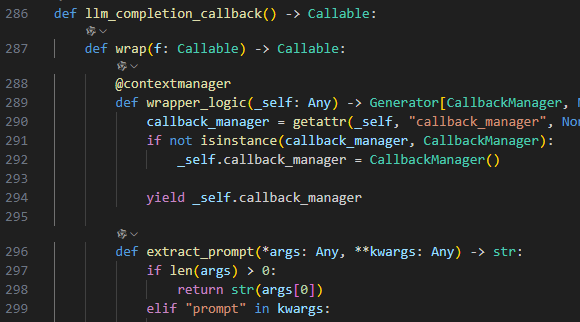
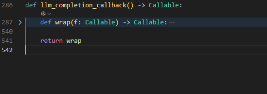

# 修饰函数的概念
如@llm_completion_callback() 这是一个修饰函数修饰函数。
什么是装饰器函数呢？

装饰器函数是一种在 Python 中非常有用的设计模式，它允许你在不修改原函数代码的情况下，给函数添加额外的功能。

下面通过一个简单的例子来解释装饰器的概念。

> 假设我们有一个函数 `add`，用于计算两个数的和。现在我们希望在调用这个函数时，能够自动记录它的执行时间，而不需要修改 `add` 函数本身的代码。

`步骤 1: 定义原始函数`
```python
def add(a, b):
    return a + b
```

`步骤 2: 定义装饰器函数`
装饰器本质上是一个接受函数作为参数，并返回一个新的函数的高阶函数。

```python
import time

def timer_decorator(func):
    def wrapper(*args, **kwargs):
        start_time = time.time()  # 记录开始时间
        result = func(*args, **kwargs)  # 调用原始函数
        end_time = time.time()  # 记录结束时间
        print(f"函数 {func.__name__} 执行时间: {end_time - start_time:.4f} 秒")
        return result
    return wrapper
```

`步骤 3: 使用装饰器`
我们可以通过 `@` 符号将装饰器应用到 `add` 函数上：

```python
@timer_decorator
def add(a, b):
    return a + b
```

等价于：
```python
def add(a, b):
    return a + b

add = timer_decorator(add)
```

`步骤 4: 测试装饰器`
调用 `add` 函数时，会自动打印出它的执行时间。

```python
result = add(3, 5)
print("结果:", result)
```

`输出示例：`
```
函数 add 执行时间: 0.0001 秒
结果: 8
```

---
好了，经过上面的例子你可能已经简单了解啥是装饰函数了，那我们先看一下下面的函数，然后再回到这里

```
from llama_index.core.llms.callbacks import llm_completion_callback
@llm_completion_callback()
def complete(self, prompt: str, **kwargs: Any) -> CompletionResponse:
    # 调用OpenAI API生成文本
    response = self.client.chat.completions.create(model=self.model_name, messages=[{"role": "user", "content": prompt}])
    # 检查响应中是否有choices字段，并提取生成的文本
    if hasattr(response, 'choices') and len(response.choices) > 0:
        response_text = response.choices[0].message.content
        return CompletionResponse(text=response_text)  # 返回生成的文本
    else:
        raise Exception(f"Unexpected response format: {response}")  # 如果响应格式不符合预期，抛出异常
```

我们进入到llama_index的源码中，看看这个函数



是不是很奇怪，因为没有传入参数啊，但是别着急，我们折叠一下代码




所以实际上wrap才是真正的装饰函数的定义,再接着往下看

我们看见还有一个 `@property`的装饰器，不过这个装饰器类是一个内置类，我们不用太过深究,它的主要目的是用于将方法伪装成属性。


# complete和stream_complete的区别

这两个函数 `complete` 和 `stream_complete` 的主要区别在于它们处理文本生成的方式不同：一个是**同步的**，另一个是**流式的**。下面详细解释这两种方式的区别以及它们各自的应用场景。

---

## **1. 同步的文本生成 (`complete` 方法)**

### **特点**
- **一次性返回结果**：`complete` 方法会等待整个文本生成过程完成，然后一次性返回生成的完整文本。
- **阻塞式操作**：在调用 `complete` 时，程序会一直等待，直到 API 返回完整的响应。在此期间，调用方无法获取任何中间结果。
- **适合简单任务**：适用于需要完整生成内容后再进行后续处理的场景，例如生成一段完整的回答、翻译一段文字等。

### **代码逻辑**
1. 调用 OpenAI API，传入用户输入的 `prompt`。
2. 等待 API 返回完整的响应（即 `response` 对象）。
3. 检查响应中是否有 `choices` 字段，并提取生成的文本。
4. 如果响应格式正确，返回生成的文本；否则抛出异常。

### **示例**
假设用户输入 `prompt = "What is AI?"`，`complete` 方法会等待模型生成完整的回答（例如 `"AI is a field of computer science..."`），然后将整个回答返回给调用方。

---

## **2. 流式的文本生成 (`stream_complete` 方法)**

### **特点**
- **逐步返回结果**：`stream_complete` 方法会以“流”的形式逐步返回生成的文本，每次返回一小部分（称为一个“chunk”或“增量”）。
- **非阻塞式操作**：调用方可以在生成过程中实时获取部分结果，而不需要等待整个生成过程完成。
- **适合实时交互**：适用于需要实时展示生成内容的场景，例如聊天机器人、实时字幕生成、语音转文字等。

### **代码逻辑**
1. 调用 OpenAI API，传入用户输入的 `prompt`，并设置 `stream=True` 参数以启用流式响应。
2. 遍历 API 返回的每个“chunk”，提取其中的内容。
3. 如果某个 chunk 中有内容，则将其作为增量返回给调用方。
4. 如果发生异常或响应格式不符合预期，抛出异常。

### **示例**
假设用户输入 `prompt = "What is AI?"`，`stream_complete` 方法会逐步返回生成的文本，例如：
- 第一个 chunk：`"AI"`
- 第二个 chunk：`" is"`
- 第三个 chunk：`" a"`
- 第四个 chunk：`" field"`
- ...

调用方可以实时显示这些部分结果，从而提升用户体验。

---

## **3. 同步 vs 流式：核心区别**

| 特性                  | 同步 (`complete`)                          | 流式 (`stream_complete`)                     |
|-----------------------|--------------------------------------------|---------------------------------------------|
| **返回方式**          | 一次性返回完整结果                        | 逐步返回部分结果                            |
| **阻塞性**            | 阻塞式，需等待生成完成                    | 非阻塞式，可实时获取部分结果                |
| **适用场景**          | 需要完整结果后再处理                      | 需要实时展示生成内容                       |
| **API 参数**          | 默认行为                                  | 需设置 `stream=True`                        |
| **性能**              | 可能延迟较高                              | 延迟较低，但可能增加网络开销               |

---

### **什么是流式？**

流式是一种数据传输方式，特点是数据以小块（chunk）的形式逐步传输，而不是一次性传输完整内容。在文本生成中，流式允许模型逐步生成内容，并将每一步的结果实时返回给调用方。

#### **优点**
- **低延迟**：用户可以更快地看到部分内容，而不需要等待整个生成过程完成。
- **更好的用户体验**：在聊天机器人等场景中，用户可以看到回答逐步生成的过程，类似于与人类对话的感觉。
- **灵活性**：可以根据需要中断生成过程，节省资源。

#### **缺点**
- **实现复杂度较高**：需要处理流式数据的接收和解析。
- **网络开销可能增加**：由于数据分多次传输，可能会增加网络通信的次数。

---

### **什么是同步？**

同步是一种数据传输方式，特点是调用方发送请求后，必须等待服务端完成所有处理并返回完整结果后才能继续执行后续操作。

#### **优点**
- **实现简单**：调用方只需等待一次响应即可。
- **适合简单任务**：对于不需要实时反馈的任务，同步方式更加直观。

#### **缺点**
- **高延迟**：如果生成时间较长，调用方需要长时间等待。
- **用户体验较差**：在需要实时反馈的场景中，同步方式显得不够灵活。

---

### **总结**

- **同步的文本生成 (`complete`)**：适合需要完整结果后再处理的场景，实现简单，但延迟较高。
- **流式的文本生成 (`stream_complete`)**：适合需要实时展示生成内容的场景，延迟较低，但实现复杂度较高。

根据具体需求选择合适的实现方式。例如，在聊天机器人中，通常使用流式生成以提升用户体验；而在批量生成任务中，同步生成可能更合适。


# yield CompletionResponse(text=content, delta=content) 的解释

这行代码是 `stream_complete` 方法中的核心部分，用于逐步返回生成的文本内容。为了理解它的作用，我们需要从以下几个方面进行分析：

---

## **1. `yield` 的作用**

在 Python 中，`yield` 是一个关键字，用于定义**生成器（Generator）**。生成器是一种特殊的函数，它不会一次性返回所有结果，而是每次调用时返回一个值，并保存当前的状态，以便下次继续执行。

### **特点**
- **逐步返回结果**：生成器通过 `yield` 每次返回一个值，而不是一次性返回所有结果。
- **节省内存**：生成器不会将所有结果存储在内存中，而是按需生成，适合处理大量数据或流式数据。
- **惰性计算**：只有在需要时才会生成下一个值。

在 `stream_complete` 方法中，`yield` 用于逐步返回模型生成的文本内容，每次返回一个“增量”（即一个 chunk 的内容）。

---

## **2. `CompletionResponse` 的作用**

`CompletionResponse` 是一个自定义的类（或数据结构），用于封装生成的文本和相关元信息。在这段代码中，它被用来表示每个 chunk 的响应内容。

### **参数解释**
- `text=content`：表示当前 chunk 的完整文本内容。
- `delta=content`：表示当前 chunk 的增量内容（即相对于上一个 chunk 新增的部分）。

这两个字段的具体含义如下：
- **`text`**：通常用于表示到目前为止生成的所有文本内容（累计的结果）。
- **`delta`**：表示当前 chunk 新增的部分内容（增量更新）。

在流式生成中，API 通常会以增量的形式返回每个 chunk 的内容，因此需要区分“累计结果”和“增量更新”。

---

## **3. 为什么需要 `yield CompletionResponse`？**

在流式生成的场景中，模型会逐步生成文本内容，并将每个部分（chunk）实时返回给调用方。使用 `yield` 和 `CompletionResponse` 的组合可以实现以下目标：

### **(1) 实时返回部分结果**
- 每当模型生成一个新的 chunk，`yield` 就会立即将其封装为 `CompletionResponse` 并返回给调用方。
- 调用方可以在接收到每个 chunk 后立即处理（例如显示在界面上），而不需要等待整个生成过程完成。

### **(2) 提供清晰的数据结构**
- `CompletionResponse` 将生成的文本和增量内容封装在一起，方便调用方理解和使用。
- 通过 `text` 和 `delta` 字段，调用方可以清楚地知道当前生成的完整内容以及新增的部分内容。

### **(3) 支持流式处理**
- 使用生成器（`yield`）可以让调用方以流式的方式处理数据，避免一次性加载所有内容导致的内存压力。

---

## **4. 示例说明**

假设用户输入的 `prompt = "What is AI?"`，模型逐步生成以下内容：

### **模型生成的 chunks**
1. 第一个 chunk：`"AI"`
2. 第二个 chunk：`" is"`
3. 第三个 chunk：`" a"`
4. 第四个 chunk：`" field"`

### **`stream_complete` 的执行过程**
- 当模型生成第一个 chunk `"AI"` 时：
  - `content = "AI"`
  - `yield CompletionResponse(text="AI", delta="AI")`
- 当模型生成第二个 chunk `" is"` 时：
  - `content = " is"`
  - `yield CompletionResponse(text="AI is", delta=" is")`
- 当模型生成第三个 chunk `" a"` 时：
  - `content = " a"`
  - `yield CompletionResponse(text="AI is a", delta=" a")`
- 当模型生成第四个 chunk `" field"` 时：
  - `content = " field"`
  - `yield CompletionResponse(text="AI is a field", delta=" field")`

### **调用方的处理**
调用方可以通过遍历生成器来逐步获取每个 chunk 的内容。例如：

```python
for response in stream_complete(prompt="What is AI?"):
    print(f"Full text: {response.text}")
    print(f"Delta: {response.delta}")
```

输出结果可能是：
```
Full text: AI
Delta: AI

Full text: AI is
Delta:  is

Full text: AI is a
Delta:  a

Full text: AI is a field
Delta:  field
```

---

## **5. 总结**

- **`yield`**：用于逐步返回生成的内容，支持流式处理。
- **`CompletionResponse`**：用于封装每个 chunk 的文本和增量内容，提供清晰的数据结构。
- **`yield CompletionResponse(text=content, delta=content)`**：将当前 chunk 的内容封装为响应对象并返回，允许调用方实时获取生成的部分结果。

这种设计非常适合需要实时展示生成内容的场景，例如聊天机器人、实时字幕生成等。


# ReActAgent.from_tools 工作流程解释

在这段代码中，`ReActAgent.from_tools` 是一个用于创建 `ReActAgent` 实例的类方法。`ReActAgent` 是一种基于 ReAct（Reasoning + Acting）框架的智能体，能够结合推理和行动来解决问题。下面我将逐步解释这段代码的工作原理以及它是如何实现的。

---

## 1. **ReAct 框架简介**
ReAct 是一种结合了推理（Reasoning）和行动（Acting）的智能体框架。它通过以下步骤工作：
- **推理**：智能体根据当前的任务或问题进行思考，生成下一步的行动计划。
- **行动**：智能体调用工具或执行具体的操作来完成任务。
- **观察**：智能体观察行动的结果，并将其作为新的输入，继续推理和行动。

这种框架特别适合需要多步推理和工具调用的任务，例如数学计算、问答系统、规划等。

---

## 2. **代码解析**
```python
agent = ReActAgent.from_tools([multiply_tool, add_tool], llm=llm, verbose=True)
```

### (1) **`from_tools` 方法**
`from_tools` 是一个类方法，用于初始化 `ReActAgent` 实例。它的主要作用是将一组工具（tools）与智能体绑定，并配置其他参数（如语言模型 `llm` 和日志输出 `verbose`）。以下是它的可能实现逻辑：

```python
@classmethod
def from_tools(cls, tools, llm, verbose=False):
    # 初始化智能体实例
    agent = cls(llm=llm, verbose=verbose)
    
    # 将工具绑定到智能体
    agent.bind_tools(tools)
    
    return agent
```

- `tools`: 这是一个工具列表，例如 `[multiply_tool, add_tool]`。每个工具通常是一个函数或类实例，定义了某种具体的功能（如乘法、加法）。
- `llm`: 这是语言模型（Language Model），用于生成推理和行动计划。它可以是任何支持文本生成的模型，例如 GPT、LLaMA 等。
- `verbose`: 如果为 `True`，智能体会在运行时输出详细的日志信息，便于调试和观察其推理过程。

### (2) **工具绑定**
`bind_tools` 方法的作用是将工具列表注册到智能体中，使其能够在推理过程中调用这些工具。以下是可能的实现：

```python
def bind_tools(self, tools):
    self.tools = {tool.name: tool for tool in tools}
```

- 假设每个工具都有一个 `name` 属性（例如 `multiply_tool.name = "multiply"`），这里会将工具存储在一个字典中，方便后续通过名称调用。

### (3) **智能体的核心逻辑**
`ReActAgent` 的核心逻辑通常包括以下几个步骤：
1. **接收任务**：智能体接收到一个问题或任务。
2. **推理**：使用语言模型生成下一步的行动计划。
3. **选择工具**：根据推理结果，选择合适的工具并调用。
4. **执行工具**：调用工具并获取结果。
5. **更新状态**：将工具的结果作为新的输入，继续推理和行动，直到任务完成。

以下是一个简化的伪代码示例：

```python
class ReActAgent:
    def __init__(self, llm, verbose=False):
        self.llm = llm
        self.verbose = verbose
        self.tools = {}

    def bind_tools(self, tools):
        self.tools = {tool.name: tool for tool in tools}

    def run(self, task):
        while not self.is_task_complete(task):
            # 推理：生成下一步行动计划
            action_plan = self.reason(task)
            
            if self.verbose:
                print(f"Reasoning result: {action_plan}")
            
            # 解析行动计划，提取工具名称和参数
            tool_name, tool_args = self.parse_action(action_plan)
            
            # 调用工具
            tool_result = self.use_tool(tool_name, tool_args)
            
            if self.verbose:
                print(f"Tool result: {tool_result}")
            
            # 更新任务状态
            task.update(tool_result)
        
        return task.result

    def reason(self, task):
        # 使用语言模型生成行动计划
        prompt = f"Given the task: {task}, what is the next step?"
        return self.llm.generate(prompt)

    def parse_action(self, action_plan):
        # 解析行动计划，提取工具名称和参数
        # 示例：假设行动计划格式为 "use_tool('multiply', {'a': 2, 'b': 3})"
        match = re.match(r"use_tool\('(\w+)', ({.*})\)", action_plan)
        tool_name = match.group(1)
        tool_args = eval(match.group(2))
        return tool_name, tool_args

    def use_tool(self, tool_name, tool_args):
        # 调用工具并返回结果
        tool = self.tools[tool_name]
        return tool(**tool_args)
```

---

## 3. **工具示例**
工具通常是简单的函数或类实例，定义了某种具体的功能。例如：

```python
class MultiplyTool:
    name = "multiply"
    
    def __call__(self, a, b):
        return a * b

class AddTool:
    name = "add"
    
    def __call__(self, a, b):
        return a + b

multiply_tool = MultiplyTool()
add_tool = AddTool()
```

这些工具会被注册到智能体中，并在推理过程中被调用。

---

## 4. **运行流程**
假设我们有一个任务 `task = "Calculate 2 * 3 + 4"`，以下是智能体的运行流程：

1. **推理**：智能体生成行动计划 `"use_tool('multiply', {'a': 2, 'b': 3})"`。
2. **调用工具**：调用 `multiply_tool(2, 3)`，得到结果 `6`。
3. **更新任务**：任务变为 `"Calculate 6 + 4"`。
4. **推理**：智能体生成行动计划 `"use_tool('add', {'a': 6, 'b': 4})"`。
5. **调用工具**：调用 `add_tool(6, 4)`，得到结果 `10`。
6. **完成任务**：返回最终结果 `10`。

---

## 5. **总结**
这段代码的核心是通过 `ReActAgent` 将语言模型与工具结合起来，形成一个能够推理和行动的智能体。`from_tools` 方法负责初始化智能体并绑定工具，而智能体的运行逻辑则通过推理、工具调用和状态更新来完成任务。

如果你有更多具体问题或需要进一步解释，请随时告诉我！