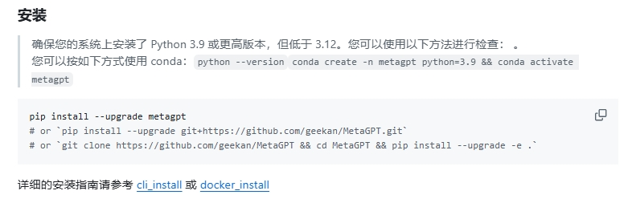

# MetaGPT 
## 项目地址

MetaGPT是个人开发者开发的ai-agent的应用

[github MetaGPT](https://github.com/geekan/MetaGPT)
[MetaGPT官方文档](https://docs.deepwisdom.ai/main/en/guide/get_started/introduction.html)

## 其中可能遇到的问题
### 1. pip install metagpt出现问题
直接用`pip install metagpt`可能会报错，文件的hash不一致，可以使用`pip install --upgrade metagpt`命令。
官网提供了如下安装方式可以参考

## 概念解释
### 智能体
在MetaGPT看来，可以将智能体想象成环境中的数字人，其中

智能体 = 大语言模型（LLM） + 观察 + 思考 + 行动 + 记忆

这个公式概括了智能体的功能本质。为了理解每个组成部分，让我们将其与人类进行类比：

大语言模型（LLM）：LLM作为智能体的“大脑”部分，使其能够处理信息，从交互中学习，做出决策并执行行动。
观察：这是智能体的感知机制，使其能够感知其环境。智能体可能会接收来自另一个智能体的文本消息、来自监视摄像头的视觉数据或来自客户服务录音的音频等一系列信号。这些观察构成了所有后续行动的基础。
思考：思考过程涉及分析观察结果和记忆内容并考虑可能的行动。这是智能体内部的决策过程，其可能由LLM进行驱动。
行动：这些是智能体对其思考和观察的显式响应。行动可以是利用 LLM 生成代码，或是手动预定义的操作，如阅读本地文件。此外，智能体还可以执行使用工具的操作，包括在互联网上搜索天气，使用计算器进行数学计算等。
记忆：智能体的记忆存储过去的经验。这对学习至关重要，因为它允许智能体参考先前的结果并据此调整未来的行动。
### 多智能体
多智能体系统可以视为一个智能体社会，其中

多智能体 = 智能体 + 环境 + 标准流程（SOP） + 通信 + 经济

这些组件各自发挥着重要的作用：

智能体：在上面单独定义的基础上，在多智能体系统中的智能体协同工作，每个智能体都具备独特有的LLM、观察、思考、行动和记忆。
环境：环境是智能体生存和互动的公共场所。智能体从环境中观察到重要信息，并发布行动的输出结果以供其他智能体使用。
标准流程（SOP）：这些是管理智能体行动和交互的既定程序，确保系统内部的有序和高效运作。例如，在汽车制造的SOP中，一个智能体焊接汽车零件，而另一个安装电缆，保持装配线的有序运作。
通信：通信是智能体之间信息交流的过程。它对于系统内的协作、谈判和竞争至关重要。
经济：这指的是多智能体环境中的价值交换系统，决定资源分配和任务优先级。
### 任务
对于每一个任务，至少要明确两点：目标和期望。目标和期望都可以用自然语言去描述。

其他需要明确的是 上下文、回调、输出、使用的工具。

回调可以是一个python函数。使用的工具可以是一个python列表。

你可以用pydantic去约束输出的合适。把大模型的模糊输出变为强制结构化输出。

## MetaGPT概述（来源于Qwen2.5-max web search）

### **MetaGPT 概述**
MetaGPT 是一种多智能体框架，能够将不同的 GPT 模型分配到不同的角色中，形成一个协作的软件实体，用于解决复杂任务。它通过模拟团队协作的方式，将任务分解为多个子任务，并由不同角色（如项目经理、开发人员、测试人员等）分工完成 [[2]]。

---

### **MetaGPT 的主要功能**
| 功能模块                | 描述                                                                                     |
|-------------------------|------------------------------------------------------------------------------------------|
| **需求分析**            | 接收用户输入的一行需求，生成详细的需求文档、用户故事和任务分解结构 (WBS)。               |
| **代码生成与优化**      | 自动生成高质量代码，支持多种编程语言，并提供调试和优化建议。                             |
| **项目管理**            | 通过模拟敏捷开发流程，自动分配任务、跟踪进度并生成项目报告。                             |
| **数据科学支持**        | 提供数据解释器功能，支持动态规划、工具利用和逻辑验证，适用于数据分析和建模任务 [[7]]。   |
| **多模态支持**          | 支持文本、图像、语音等多种模态，例如 MetaGPT 安卓助理可学习用户行为并提供建议 [[5]]。    |
| **自动化测试**          | 自动生成测试用例，检测代码中的潜在问题，并减少人工修订成本 [[3]]。                       |

---

### **MetaGPT 的优缺点**
| **优点**                                                                                   | **缺点**                                                                                   |
|---------------------------------------------------------------------------------------------|---------------------------------------------------------------------------------------------|
| **高度自动化和智能化**：显著提高开发效率，降低错误率，适合复杂的软件开发项目 [[4]]。       | **依赖模型质量**：输出结果的质量依赖于底层 GPT 模型的能力，可能存在幻觉问题 [[9]]。         |
| **多智能体协作**：通过多 Agent 协作处理更复杂的任务，解决了单一模型在复杂任务中的局限性。 | **人工干预成本**：尽管自动化程度高，但某些任务仍需要人工修订，如调试或导入软件包 [[3]]。   |
| **灵活的任务分解**：通过 SOP（标准操作流程）融入多智能体协作，提升任务分解和执行的准确性。 | **资源消耗较高**：运行多个智能体可能需要较高的计算资源，尤其是大规模任务时。               |
| **广泛的应用场景**：适用于软件开发、数据分析、项目管理等多个领域 [[1]]。                  | **学习曲线较陡**：对于新手开发者来说，配置和使用 MetaGPT 可能需要一定的时间和经验。         |

---

### **MetaGPT 的更新频率**
MetaGPT 的开发团队持续对框架进行优化和更新，以下是相关信息：
- **更新周期**：根据社区反馈和实际需求，MetaGPT 的核心功能和依赖库通常每 1-2 个月更新一次 [[6]]。
- **最新更新时间**：截至 2024 年 7 月，MetaGPT 发布了针对人工修订成本优化的新版本 [[8]]。
- **更新内容**：包括但不限于角色提示的改进、新功能的添加（如数据解释器）、性能优化以及依赖库升级。

---

### **MetaGPT 的应用场景**
| 应用场景                | 示例                                                                                     |
|-------------------------|------------------------------------------------------------------------------------------|
| **软件开发**            | 自动化生成代码、测试用例和项目文档，提升开发效率 [[2]]。                                 |
| **数据分析**            | 使用数据解释器完成数据清洗、建模和可视化任务 [[7]]。                                     |
| **项目管理**            | 模拟敏捷开发流程，自动生成甘特图和任务分配表 [[4]]。                                     |
| **智能助手**            | MetaGPT 安卓助理可以根据用户习惯提供个性化建议 [[5]]。                                   |
| **教育与培训**          | 提供智能体开发教程和黑客松活动，促进智能体生态发展 [[10]]。                              |

---

### **总结**
MetaGPT 是一个多智能体协作框架，通过将不同的 GPT 模型分配到特定角色中，实现了复杂任务的高效处理。它的优势在于高度自动化、多智能体协作和广泛的应用场景，但也存在依赖模型质量、人工干预成本较高等问题。随着开发团队的持续优化，MetaGPT 在软件开发、数据分析和项目管理等领域展现了巨大的潜力。

如果需要进一步了解具体功能或配置方法，可以参考官方文档或社区资源 [[10]]。