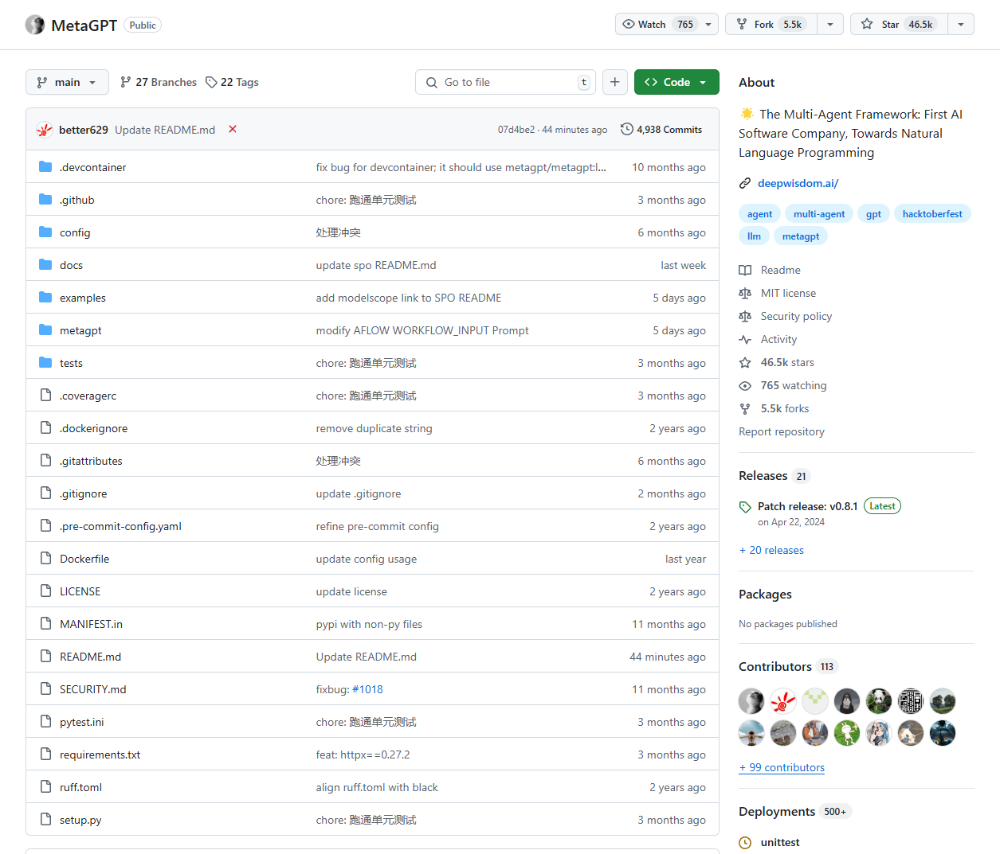
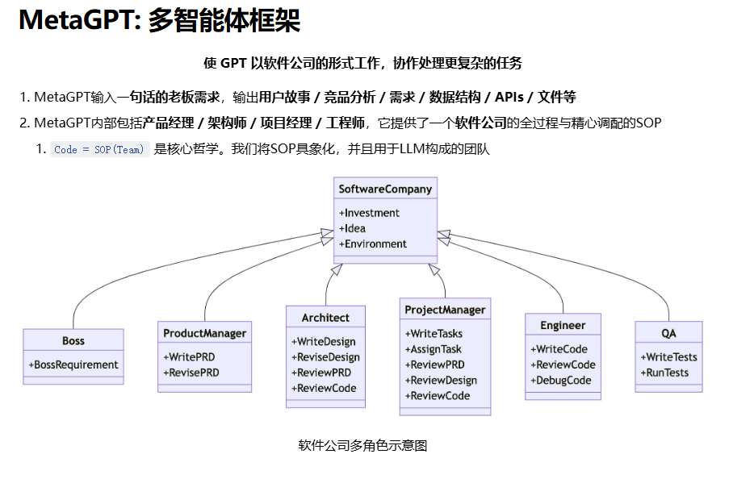
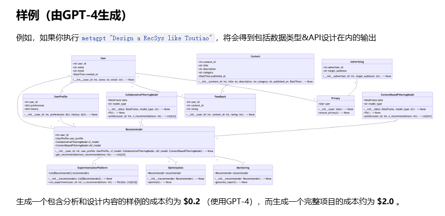

# MetaGPT学习
## MetaGPT介绍
MetaGPT是一个开源的AI应用框架，旨在通过模拟一个虚拟的软件开发团队来实现复杂的任务自动化。我写这篇文章的时候，在github当中收获了46.5 stars

它基于大语言模型（LLM, Large Language Model）构建，利用多个智能体协作完成任务，每个智能体都扮演特定的角色，类似于现实中的软件开发团队成员。

## 特点
这里是metagpt的官方介绍：官方提供了样例，我们可以看到，在实际工作当中，我们可以把一个复杂任务划分成为多个简单任务，而在大模型当中也是这样，我们可以把一个复杂任务划分成为多个简单任务，然后让多个智能体去完成，从而实现复杂的任务自动化。

https://docs.deepwisdom.ai/main/zh/guide/get_started/introduction.html

## 快速开始

下面就让我们一起开始学习metaGPT
