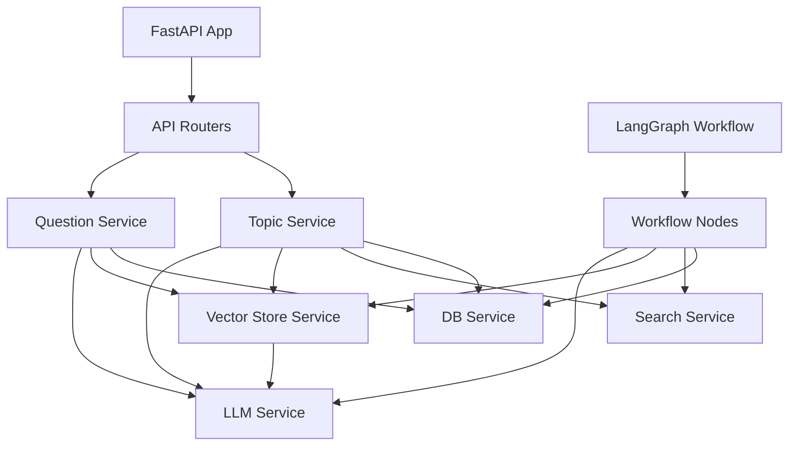
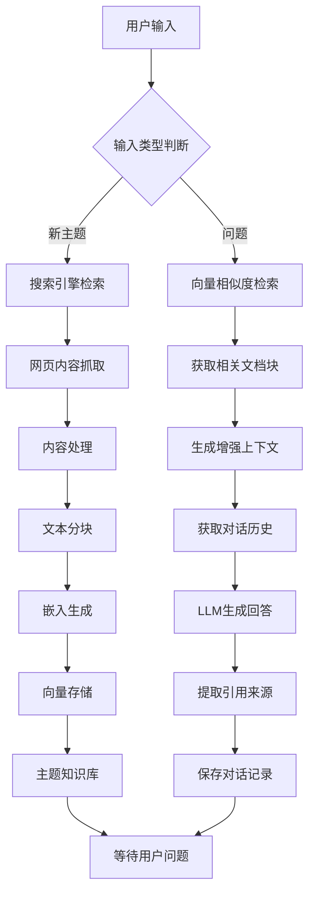

# 搜索主题回答系统 - 项目结构文档

## 1. 项目架构概览

搜索主题回答系统是一个基于LangGraph和通义大模型的RAG（检索增强生成）应用，整体采用分层架构设计，主要分为以下几层：

- **API层**：处理HTTP请求和响应，提供RESTful API接口
- **服务层**：实现业务逻辑，协调各组件工作
- **工作流层**：基于LangGraph的工作流定义和执行
- **数据访问层**：负责数据存储和检索
- **基础设施层**：配置、工具和外部服务集成

系统通过FastAPI提供Web服务，使用MongoDB存储主题和消息数据，使用Chroma作为向量数据库存储文档嵌入，并通过通义大模型生成回答。整个RAG流程由LangGraph工作流统一管理，确保各步骤有序执行和状态管理。

## 2. 主要目录结构及其职责

```
app/
├── api/                    # API层 - 处理HTTP请求和响应
│   └── routers/            # 路由定义，按资源类型组织
│       └── topics.py       # 主题和问题相关的API路由
│
├── core/                   # 核心配置层 - 系统级配置和设置
│   └── config.py           # 应用配置，从环境变量加载
│
├── graph/                  # 工作流层 - LangGraph工作流定义
│   ├── nodes.py            # 工作流节点函数
│   └── workflow.py         # 工作流图定义和编排
│
├── models/                 # 数据模型层 - 内部数据结构
│   └── state.py            # 工作流状态模型
│
├── schemas/                # 数据模式层 - API数据结构
│   └── topic.py            # 主题和问题相关的数据模式
│
├── services/               # 服务层 - 业务逻辑实现
│   ├── db_service.py       # 数据库服务 - MongoDB交互
│   ├── llm_service.py      # 大模型服务 - 通义模型调用
│   ├── search_service.py   # 搜索服务 - 搜索引擎交互
│   ├── topic_service.py    # 主题服务 - 主题管理
│   ├── question_service.py # 问题服务 - 问答处理
│   └── vector_store_service.py  # 向量存储服务 - 向量数据库操作
│
└── main.py                 # 应用入口 - FastAPI应用定义

# 项目根目录文件
├── requirements.txt        # 项目依赖
├── sample.env              # 环境变量示例
└── README.md               # 项目说明
```

## 3. 关键模块的依赖关系图



## 4. 核心类和接口的功能说明

### API层

**TopicRouter**
- `POST /topics`: 创建新主题并启动搜索
- `GET /topics/{topic_id}`: 获取主题详情和对话历史
- `POST /topics/{topic_id}/questions`: 向特定主题提问
- `GET /topics/{topic_id}/history`: 获取特定主题的对话历史

### 服务层

**TopicService**
- `create_topic(topic: str) -> UUID`: 创建新主题
- `get_topic(topic_id: UUID) -> TopicDetail`: 获取主题详情
- `get_history(topic_id: UUID) -> List[Dict]`: 获取主题对话历史
- `search_and_process_topic(topic_id: UUID) -> bool`: 搜索主题并处理结果

**QuestionService**
- `answer_question(topic_id: UUID, question: str) -> Answer`: 回答用户问题

**DBService**
- `create_topic(topic_text: str) -> UUID`: 创建新主题并返回主题ID
- `update_topic_status(topic_id: UUID, status: str, summary: Optional[str]) -> bool`: 更新主题状态和摘要
- `get_topic(topic_id: UUID) -> Optional[TopicDetail]`: 获取主题详情
- `add_message(topic_id: UUID, role: str, content: str) -> UUID`: 添加消息到主题
- `get_messages(topic_id: UUID, limit: int) -> List[Dict]`: 获取主题的最近消息

**SearchService**
- `search_topic(topic: str) -> List[Dict]`: 通过搜索引擎API搜索主题相关信息
- `fetch_webpage_content(url: str) -> Optional[str]`: 获取网页内容
- `process_search_results(results: List[Dict]) -> List[Dict]`: 处理搜索结果并提取网页内容

**VectorStoreService**
- `process_and_store_documents(topic_id: UUID, documents: List[Dict]) -> bool`: 处理文档并存储到向量数据库
- `retrieve_relevant_chunks(topic_id: UUID, query: str, top_k: int) -> List[Dict]`: 检索与查询相关的文档块
- `get_enhanced_context(chunks: List[Dict]) -> str`: 从检索到的文档块生成增强上下文

**LLMService**
- `get_embeddings(texts: List[str]) -> List[List[float]]`: 获取文本的向量嵌入
- `generate_response(prompt: str, **kwargs) -> str`: 调用LLM生成响应
- `get_search_summary(search_results: List[Dict]) -> str`: 生成搜索结果摘要
- `answer_with_rag(question: str, context: str, history: List[Dict]) -> str`: 使用RAG方式回答问题

### 工作流层

**TopicSearchApp**
- `process_new_topic(topic_id: UUID, topic: str) -> Dict`: 处理新主题
- `process_question(topic_id: UUID, question: str) -> Dict`: 处理问题

**LangGraph节点**
- `determine_input_type`: 确定输入类型（新主题或问题）
- `search_topic`: 搜索主题并获取结果
- `process_content`: 处理搜索结果内容
- `vectorize_store`: 向量化存储处理后的内容
- `create_knowledge_base`: 创建知识库并更新主题状态
- `retrieve_content`: 检索与问题相关的内容
- `generate_context`: 生成增强上下文
- `generate_answer`: 生成回答
- `verify_sources`: 验证回答来源
- `present_answer`: 呈现回答并保存到数据库

## 5. 数据流向图



## 6. API接口清单

### 主题管理接口

| 端点 | 方法 | 描述 | 请求体 | 响应 |
|------|------|------|--------|------|
| `/api/topics` | POST | 创建新主题 | `{"topic": string}` | `{"topic_id": UUID, "status": string, "summary": string?}` |
| `/api/topics/{topic_id}` | GET | 获取主题详情 | - | `{"id": UUID, "topic": string, "created_at": datetime, "updated_at": datetime, "history": Message[]}` |
| `/api/topics/{topic_id}/questions` | POST | 向主题提问 | `{"question": string}` | `{"answer": string, "sources": Source[]}` |
| `/api/topics/{topic_id}/history` | GET | 获取对话历史 | - | `[{"role": string, "content": string, "timestamp": string}]` |

### 数据模型

**TopicCreate**
```json
{
  "topic": "string"
}
```

**QuestionCreate**
```json
{
  "question": "string"
}
```

**TopicResponse**
```json
{
  "topic_id": "UUID",
  "status": "string",
  "summary": "string" // 可选
}
```

**Answer**
```json
{
  "answer": "string",
  "sources": [
    {
      "url": "string",
      "snippet": "string"
    }
  ]
}
```

## 7. 常见的代码模式和约定

### 错误处理模式

系统采用异常捕获和日志记录的方式处理错误：

```python
try:
    # 操作代码
    result = await some_operation()
    return result
except Exception as e:
    logger.error(f"操作失败: {str(e)}")
    # 可能的回退操作或错误响应
    return error_response
```

### 依赖注入模式

FastAPI路由使用依赖注入获取服务实例：

```python
def get_topic_service():
    return TopicService()

@router.post("/topics")
async def create_topic(
    topic_data: TopicCreate,
    topic_service: TopicService = Depends(get_topic_service)
):
    # 使用注入的服务
    return await topic_service.create_topic(topic_data.topic)
```

### 异步操作模式

所有I/O操作都使用异步方式实现：

```python
async def fetch_data():
    async with aiohttp.ClientSession() as session:
        async with session.get(url) as response:
            return await response.json()
```

### 状态管理模式

LangGraph工作流使用明确的状态对象传递和更新状态：

```python
async def process_node(state: TopicSearchState) -> TopicSearchState:
    # 处理逻辑
    state.some_field = new_value
    return state
```

### 服务层抽象模式

各个服务封装特定功能，隐藏实现细节：

```python
class SomeService:
    def __init__(self):
        # 初始化资源
        self.resource = Resource()
    
    async def perform_operation(self, data):
        # 实现业务逻辑
        return result
```

### 配置管理模式

使用Pydantic和环境变量管理配置：

```python
class Settings(BaseSettings):
    SOME_CONFIG: str = "default_value"
    
    class Config:
        env_file = ".env"
``` 