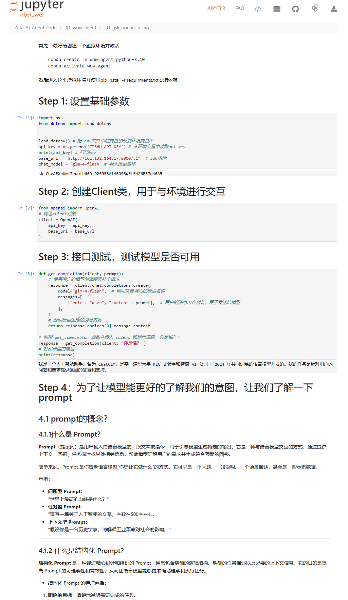

# 简介
本文件夹是AI Agent的学习记录

## ipynb文件查看方式
很多ipynb文件在github中无法直接查看，可以使用下面的方式查看
1. nbviewer查看

https://nbviewer.org/

比如下面这个文件,github打不开

可以把url地址复制到上面的网站中查看

## 使用教程
进入每一个目录下面之后，根据对应的requirements.txt安装依赖包

## 项目中常用的函数说明

### from dotenv import load_dotenv
load_dotenv函数用于加载环境变量，如果文件所在的路径下面不存在.env文件会到上一级目录寻找，如果加载不成功也不会报错，所以使用的时候最好打印一下输出
